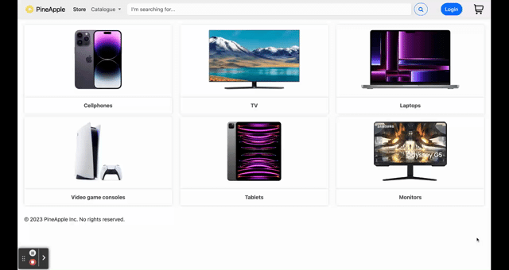

# ecommerce_website
Final project for Beetroot Academy's Python course

## Description
This is an ecommerce website for a fictional company. 


Technologies used:
- Django
- Django REST Framework
- Docker and Docker Compose
- PostgreSQL with Adminer
- Celery with Redis as message broker
- Redis as cache
- Nginx as reverse proxy
- Gunicorn as WSGI server
- Elasticsearch for real-time product search
- AWS EC2 instance
- Godaddy domain
- TLS certificate from Cloudflare
- Python
- AJAX for async requests to the server and Elasticsearch
- HTML, CSS, Bootstrap, JS

Some of the features:
- User registration and login
- Product catalog with filtering and sorting
- Real-time product search
- Interactive shopping cart and checkout
- Product reviews
- Async email sending with Celery (using Gmail SMTP)
- Order history
- Admin panel
- REST API using Django REST Framework


Project is deployed on AWS EC2 and can be accessed at https://lexglu.online

## Demo




## Installation
1. Clone the repository to your local machine

```
git clone https://github.com/LexGlu/ecommerce_website.git
```

2. cd into the project directory
3. Install Docker and Docker Compose
4. Create a `.env` file in the project directory and add the following variables:
```
SECRET_KEY=your_secret_key
DEBUG=<0 or 1>
ALLOWED_HOSTS=localhost,your_domain

#postgres
POSTGRES_ENGINE=django.db.backends.postgresql
POSTGRES_DATABASE=your_postgres_database
POSTGRES_USER=your_postgres_user
POSTGRES_PASSWORD=your_postgres_password
POSTGRES_HOST=name_of_postgres_service
POSTGRES_PORT=5432

#redis as celery's message broker
CELERY_BROKER_URL=redis://redis:6379/<db_number_0>
CELERY_RESULT_BACKEND=redis://redis:6379/<db_number_0>

#email sending with celery and gmail smtp
EMAIL_HOST_USER=your_email
EMAIL_HOST_PASSWORD=your_email_password

#redis as cache
REDIS_URL=redis://redis:6379/<db_number_1>

#elasticsearch
ELASTICSEARCH_URL=elasticsearch:9200
```

4. Run `docker-compose up -d` in the project directory
5. Go to http://localhost